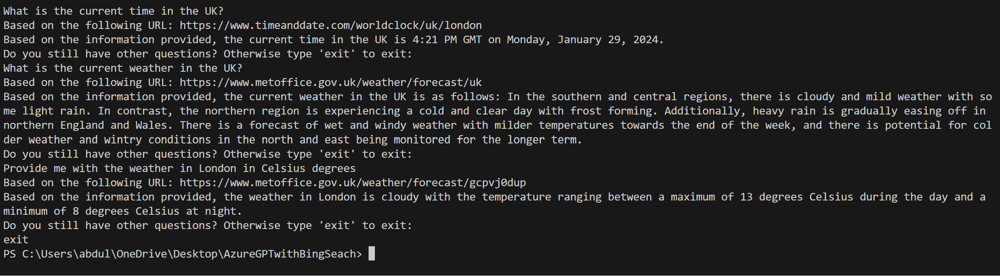

# AzureGPTwithBingSeach
In this repo I will be using Azure OpenAI and Bing Search to somehow let Azure GPT get their information from the internet. 

* [Bing Web Search API](https://learn.microsoft.com/en-us/bing/search-apis/bing-web-search/overview) used to return webpages related to the query. 
* [Azure OpenAI](https://learn.microsoft.com/en-us/azure/ai-services/openai/overview) used with the page content to provide an answer to the question. 

# Table of contents:
- [Step 1 - Getting Things Ready](https://github.com/ABDFMSM/AzureGPTwithBingSeach?tab=readme-ov-file#step-1---getting-things-ready)  
- [Step 2 - Getting a URL from the Bing Web Search API](https://github.com/ABDFMSM/AzureGPTwithBingSeach?tab=readme-ov-file#step-2---getting-a-url-from-the-bing-web-search-api)  
- [Step 3 - Getting the Contents of the Webpage](https://github.com/ABDFMSM/AzureGPTwithBingSeach?tab=readme-ov-file#step-3---getting-the-contents-of-the-webpage)  
- [Step 4 - Using Azure Open AI model to answer the question](https://github.com/ABDFMSM/AzureGPTwithBingSeach?tab=readme-ov-file#step-4---using-azure-open-ai-model-to-answer-the-question)  
- [Output Example](https://github.com/ABDFMSM/AzureGPTwithBingSeach?tab=readme-ov-file#output-example)

# Step 1 - Getting Things Ready
Before starting anything we would need to install the required python packages.  
You can do that by using the following command: 
```
pip install -r requirements.txt
```
We would need to import the following libraries: 
``` Python
import openai
import requests
from bs4 import BeautifulSoup
import os
from dotenv import load_dotenv
```
I have created .env file that will contain the keys and endpoints for the Bing and Azure OpenAI resource.  
On VScode you can create an empty file and you name it .env which should contain the following: 
  

## Configuring Bing Web Seach Resrouce
We will need to get the Bing Web Search key and store the value in the .env file as shown: 
 

To configure the Bing resource, we would use load_dotenv and os to load the key from .env file as follows: 
``` Python
load_dotenv()
# Load your Bing Search V7 subscription key from your environment variable.
subscription_key = os.getenv("Bing_key") # Bing_key is the name of the variable containing the Bing resource key in .env file. 
endpoint = "https://api.bing.microsoft.com" + "/v7.0/search"
```

## Configuring Azure OpenAI Resource: 
Afterwards, we need to do the same to configure the Azure OpenAI resource. 
We would get the Azure OpenAI resource key and endpoint from Azure portal as shown: 
   

Now we would configure AOAI resource as follows: 
``` Python
# Configure Azure OpenAI Completion Resource: 
openai.api_type = "azure"
openai.api_version = '2023-05-15'
openai.api_base = os.getenv("OpenAISweden_endpoint")
openai.api_key = os.getenv("OpenAISweden_key")
engine_name = os.getenv("OpenAISweden_engine")
```

# Step 2 - Getting a URL from the Bing Web Search API
I have created a function that will return the first URL the Bing search API find. 
``` Python
def search(query):
    mkt = 'en-US'
    params = { 'q': query, 'mkt': mkt, 'count':5, 'responseFilter': ['Webpages']}
    headers = { 'Ocp-Apim-Subscription-Key': subscription_key }

    # Call the API
    try:
        response = requests.get(endpoint, headers=headers, params=params)
        response.raise_for_status()
        return response.json()['webPages']['value'][0]

    except Exception as ex:
        raise ex
```

# Step 3 - Getting the Contents of the Webpage
After getting the URL, I would use the requests library to get the contents of the page to feed it later to the AOAI resource. 
The following function will prompt the user to ask a question and then returns the extracted webpage text and the user's question. 
``` Python
def WebContent():
    question = input("What is your question?")

    results = search(question)
    result = requests.get(results['url'])
    # I have used beautifulsoup to get a better structured output and did some post-processing to the webpage to remove extra spaces.
    soup = BeautifulSoup(result.content, 'html.parser')
    text = soup.find('body').get_text().strip()
    cleaned_text = ' '.join(text.split('\n'))
    cleaned_text = ' '.join(text.split())
    # Return a tuple of the extracted webpage text and the question that was asked by the user. 
    return cleaned_text, question
```

# Step 4 - Using Azure Open AI model to answer the question
Feeding the webpage contents and the question to the AOAI resource.  
Since AOAI model is not connected to the internet, the AOAI will use the webpage contents as a way to get real-time information to answer the user's question. 
``` Python
def GPTResponse(Text, question):
    #Modify prompt and sys_msg as needed
    prompt = f"Use the following information: {Text} to get the answer to the following question {question}."
    sys_msg = "You are an AI assistant that will get information from the first URL in the Bing search so you are somehow getting information from the internet, and you have to use that information to provide an answer to the question."

    response = openai.ChatCompletion.create(engine= engine_name, messages=[
        {'role': 'system', 'content': sys_msg},
        {'role': 'user', 'content': prompt}])
    text = response['choices'][0]['message']['content']
    print(f'Answer: {text}')
```

# Output Example
Finally we can run the following code to start the search: 
``` Python
WebText, question = WebContent()
GPTResponse(WebText, question)
```
Here is the question and the response you can get: 
  


